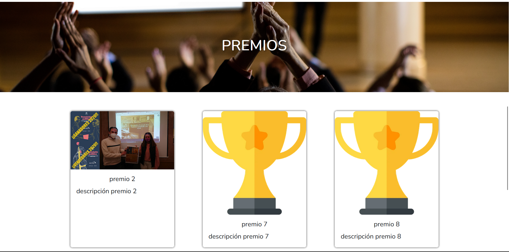
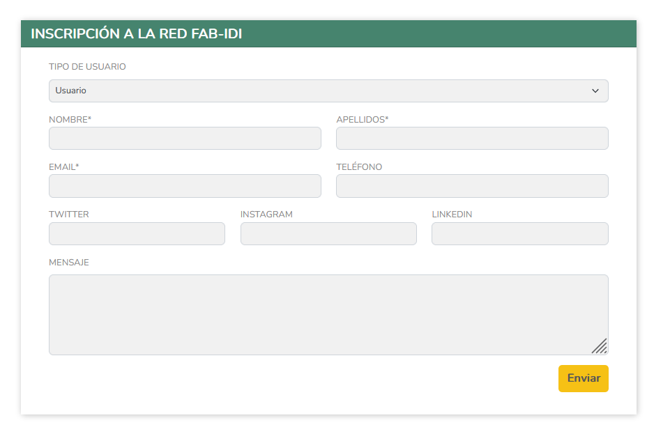

# Manual Usuario

## Índice

1. [Introducción](#introducción)

## Introducción
Este manual está dirigido a aquellos usuarios que quieran interactuar con la aplicación. En él se explicará las diferentes opciones que se ofrecen accediendo a ellas a través del menú de navegación que pueden ver en la parte superior de la página. La aplicación es abierta y en principio no requiere ningún tipo de registro para poder acceder a ella. Sin embargo hay algunas partes de que requieren de un registro previo para poder acceder a ellas y que se explicarán más adelante.

## Inicio
En esta página se explica brevemente en qué consiste la red FAB-IDI y se muestran 3 vídeos relacionados con dicha red. Justo en la parte inferior hay un botón que te lleva directamente al canal de YouTube de la Red.

En la parte inferior aparecen los premios destacados (4 como máximo) con información sobre el premio y el proyecto ganador. Si se pulsa sobre el botón que aparece justo en la parte inferior, se accede a la página de premios donde se muestran todos los premios que hay en la red.

## Quiénes Somos
Esta página ofrece una explicación sobre la red FAB-IDI y los objetivos que persigue. Además, se muestran los miembros que forman parte de la red y se ofrece la posibilidad de contactar con ellos para formar parte de la red a través de un formulario. Los datos introducido en el formulario se envían a la dirección de correo electrónico de la red.

## Jóvenes con Investigadores
Esta pestaña te redirige a una web ya existente, donde  se explica en qué consiste el programa Jóvenes con Investigadores y se muestran los proyectos que se han llevado a cabo en las diferentes ediciones. La web a la que dirige es esta: https://jovenesconinvestigadores.wordpress.com/.

## Mentorización
En esta página se explica en qué consiste el programa de mentorización y es aquí donde, en función del perfil del usuario, muestra una cosa u otra.

### No mentor
Se muestran proyectos antiguos que se han llevado a cabo en las diferentes ediciones de manera que el usuario pueda hacersae una idea de los proyectos quese ofrecen. Además, se ofrece la posibilidad de formar parte del proceso de Mentorización a través de un formulario. Los datos introducido en el formulario se envían a la dirección de correo electrónico de la red.

### Mentorización con perfil Mentor
Se muestran los proyectos que están actualmente activos y a la espera de ser mentorizados. En esta caso, aparece un formulario desde donde el Mentor puede solicitar formar parte del proceso de mentorización. Los datos introducido en el formulario se envían a la dirección de correo electrónico de la red. Inicialmente este formulario te indica que selecciones el tipo de usuario que eres: person o entidad. En función de lo que se seleccione, se muestra una ocpiones u otras.

### Proyectos Intercentros
Se explica en qué consiste el programa de Proyectos Intercentros y se muestran los proyectos que se han llevado a cabo en las diferentes ediciones. Además, se ofrece la posibilidad de formar parte de este tipo de proyectos. Los datos introducido en el formulario se envían a la dirección de correo electrónico de la red.

### Panel de Colaboradores
En esta página se observan, en modo de carrusel, los colaboradores que forman parte de la red. Se distinguen los siguientes tipos de colaboradores: embajadores, mentores e institutos. En cada carrusel pueden observase los siguientes datos:
- Tipo de colaborador.
- Foto.
- Nombre.
- Redes sociales o página web.

### Revistas
Esta página todavía no está implementada. La idea es que se suban las diferentes revistas con las que cuenta la red y el usuario pueda descargarlas.

### Blog
Al hacer clic en esta página te redirige a esta web: https://profundizaiesmartinrivero.blogspot.com/. Esta web es un blog que creada anteriormente para mostrar las diferentes actividades que se han ido llevando a cabo y que se ha querido mantener.