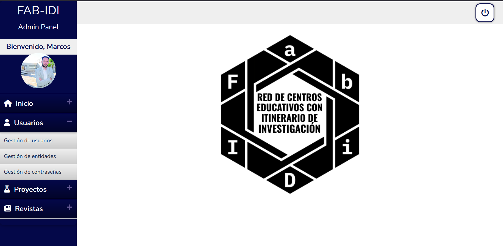

# Manual Administrador

## Índice

1. [Introducción](#introducción)

2. [Estructura de la vista](#estructura-de-la-vista)
3. [Desarrollo de las secciones del menú](#desarrollo-de-las-secciones-del-menú)
    1. [Inicio](#inicio)
    2. [Usuarios](#usuarios)
    3. [Proyectos](#proyectos)
    4. [Revistas](#revistas)
4. [Sección Inicio](#sección-inicio)
    1. [Gestión de vídeos](#gestión-de-vídeos)
    2. [Gestión de premios](#gestión-de-premios)
5. [Sección Usuarios](#sección-usuarios)
6. [Sección Proyectos](#sección-proyectos)
7. [Sección Revistas](#sección-revistas)

## Introducción 
Este manual está dirigido a aquellos usuarios que tengan el rol de administrador en la aplicación. En él se explicará cómo realizar opciónes de administración.

Para acceder al panel de administración el usuario debe acceder a través del sistema de logueo con el que cuenta la aplicación. Una vez logueado, y siempre que su perfil de usuario tenga el rol de administrador, podrá acceder al panel de administración.

## Estructura de la vista
El panel de administración es la página principal del administrador. En ella se muestran las diferentes opciones de administración que puede realizar el usuario. 

A la izquierda de la vista se ha implementado un menú lateral para facilitar la navegación. A la derecha aparece siempre el contenido de la opción seleccionada y justo encima, una barra de navegación que permite desloguarse. En algunas de las vistas se muestra un botón que redirige a la vista del usuario, de forma que el administrador pueda acceder a la aplicación y ver cómo quedan los cambios realizados.

En el panel lateral se muestran las siguientes opciones:
**Parte superior**: 
- Nombre del proyecto. Es un enlace que redirige a la página principal de la aplicación.
- Saludo al usuario y foto de perfil.

**Parte inferior**: Menú en modo acordeón desde donde se pueden visualizar las siguientes secciones:
    - **Inicio**
    - **Usuarios**
    - **Proyectos**
    - **Revistas**

## Desarrollo de las secciones del menú

### Sección Inicio
Esta sección permite al administrador gestionar dos de los elementos que aparecen en la página principal de la aplicación: los videos y los premios.

##### Gestión de vídeos
En la pantalla principal se observa una tabla que contiene información sobre 3 vídeos. Siempre van a ser tres. La información que aparece de cada uno es la siguiente:
- **Nombre**: título del vídeo.
- **URL**: enlace al vídeo. Debe ser un enlace de Youtube. 
- **Acciones**: botón que permite editar.

##### Gestión de videos - editar
Se observa un formulario donde aparecen los campos del vídeo seleccionado en modo edición. El administrador puede modificar los campos que desee y pulsar el botón de guardar para que los cambios se apliquen.

##### Gestión de premios
En la pantalla principal se observa una tabla que contiene información sobre los premios con los que ha sido galardonada la red. En esta vista podemos encontrar dos tablas claramente diferenciadas:

- **Premios Destacados**: Se muestran los premios que el administrador quiere que se vean en la pantalla de inicio como destacados. Hay un máximo de 4 premios. Los campos que aparecen son:
  1. **Imagen**
  2. **Nombre**
  3. **Fecha en la que se recibió**
  4. **Enlace web ddonde se puede encontarr más información del premio**
  5. **Acciones: editar, eliminar, quitar de destacados**. La acción de quitar de destacados permite que el premio deje de aparecer en premios destacados y por tanto que desaparezca de la página de inicio del modo usuario.
  

    
- **Listado de Premios**: contiene información sobre los premios que ha recibido la red. Por defecto solo aparecen los últimos 5 aunque contiene un buscados por nombre para poder buscar cualquier premio que esté en la base de datos.

  1. **Imagen**
  2. **Nombre**
  3. **Fecha en la que se recibió**
  4. **Enlace web ddonde se puede encontarr más información del premio**
  5. **Acciones: editar, eliminar, añadir a destacados**. La acción de añadir a destacados permite que el premio aparezca en premios destacados y por tanto que aparezca en la página de inicio del modo usuario. Esta opción desaparece cuando en la lista de destacados hay 4 premios.
  

  Al pulsar en el botón editar, la aplicación te lleva a un formulario donde aparecen los campos del premios seleccionado en modo edición. El administrador puede modificar los campos que desee y pulsar el botón de guardar para que los cambios se apliquen. 
  
  Al pulsar el botón eliminar aparece un mensaje de confirmación para que el administrador confirme que quiere eliminar el premio. Si pulsa en aceptar, el premio se elimina de la base de datos. Si pulsa en cancelar, el premio no se elimina. Es una medida de seguridad para evitar que se eliminen premios por error. 

  6. **Añadir premio**. Justo encima de la lista, aparece un botón que permite añadir un nuevo premio a la base de datos. Al pulsar sobre él, se muestra un formulario donde se deben rellenar los campos del premio. Una vez rellenados, se pulsa el botón de guardar y el premio se añade a la base de datos. Cabe destacar que en el caso de la imagen, se avisa de que se debe subir una imagen de tipo .jpg, .png o .webp y un máximo de 2mb. Si no se sube ninguna imagen, se añadirá una por defecto. El recuadro para la descripción del premio tiene un máximo de 400 caracteres por lo que se ha facilitado un contador en la parte inferior para que el administrador pueda saber cuántos caracteres le quedan.

        
  

  7. **Editar premio**. Al pulsar en el botón editar, la aplicación te lleva a un formulario donde aparecen los campos del premios seleccionado en modo edición. El administrador puede modificar los campos que desee y pulsar el botón de guardar para que los cambios se apliquen. 

  

  8. **Eliminar premio**. Al pulsar el botón eliminar aparece un mensaje de confirmación para que el administrador confirme que quiere eliminar el premio. Si pulsa en aceptar, el premio se elimina de la base de datos. Si pulsa en cancelar, el premio no se elimina. Es una medida de seguridad para evitar que se eliminen premios por error.

### Sección Usuarios
Dentro de este apartado podemos encontrar tres partes diferenciadas:

- **Gestión de usuarios**: muestra una tabla donde, por defecto, aparecen los últimos 5 usuarios que se han introducido en la base de datos. La información que aparece de cada uno es la siguiente:
  1. **Nombre**
  2. **Apellidos**
  3. **Correo electrónico**
  4. **Teléfono**
  5. **Colaborador**: indica si el usuario es colaborador o no.
  6. **Perfil**: indica si el tipo de perfil (administrador, usuario, mentor).
  7. **Acciones: editar, eliminar**. 

  

  Al pulsar en el botón editar, la aplicación te lleva a un formulario donde aparecen los campos del usuario seleccionado en modo edición. El administrador puede modificar los campos que desee y pulsar el botón de guardar para que los cambios se apliquen. 

    

  Al pulsar el botón eliminar aparece un mensaje de confirmación para que el administrador confirme que quiere eliminar el usuario. Si pulsa en aceptar, el usuario se elimina de la base de datos. Si pulsa en cancelar, el usuario no se elimina. Es una medida de seguridad para evitar que se eliminen usuarios por error. 

  

  Encima de la tabla se encuentran dos elementos:
  1. Buscador por nombre para poder buscar cualquier usuario que esté en la base de datos. 

  
  

  2. Botón de añadir nuevo usuario, que te lleva a otra vista donde se encuentra un formulario para añadir un nuevo usuario a la base de datos.

  
  
  

- **Gestión de entidades**: funciona exactamente igual que es apartado anterior solo que los datos, en lugar a usuarios, hacen referencia a entidades como tal (universidades, institutos, etc.).

  

  

  

- **Gestión de contraseñas**: esta vista muestra una tabla con los usuarios de la base de datos y un botón donde, al hacer click, genera una nueva contraseña y la envía al correo de dicho usuario. De esta forma, el administrador puede recuperar la contraseña de un usuarios específico en caso de ser necesario. 

  
  
### Sección Proyectos
Esta apartado ofrece dos vistas diferentes en función del tipo de proyecto:
- **Gestión de Proyectos PIP**: esta vista ofrece dos secciones diferentes que son;
  - Proyectos destacados: aquellos proyectos que queremos que aparezcan como destacados en la web.
  
  - Listado de proyectos. Todos los proyectos PIP.
  

Ambas secciones muestran una tabla con una estructura bastante similar, que se detalla a continuación:
- **Imagen**: imagen del proyecto.
- **Nombre**: nombre del proyecto.
- **Curso**: curso en el que se desarrolló el proyecto.
- **Acciones**: editar, eliminar, añadir a destacados o quitar de destacados (estas últimas opciones según el caso).

Cabe destacar que en la parte de acciones que el botón de añadir a destacados permite que el proyecto aparezca en la tabla de proyectos destacados y por tanto que aparezca en la página de inicio del modo usuario. Esta opción desaparece cuando en la lista de destacados hay 4 proyectos, que es el límite que ha establecido el cliente. Por otro lado, el botón de quitar de destacados permite que el proyecto deje de aparecer en la página de inicio del modo usuario.

En la parte superior de la tabla donde aparecen todos los proyectos PIP, se encuentra un buscador por nombre para poder buscar cualquier proyecto que esté en la base de datos. También se puede encontrr el botón de añadir nuevo proyecto, que te lleva a otra vista donde se encuentra un formulario para añadir un nuevo proyecto a la base de datos. 

- **Gestión de Proyectos Intercentros**: en esta caso no existe la opción de proyectos destacados. Por este motivo, la vista solo ofrece una tabla con los últimos 5 Proyectos Intercentros que hay en la base de datos. La estructura de la tabla es la siguiente:
  - **Imagen**: imagen del proyecto.
  - **Nombre**: nombre del proyecto.
  - **Curso**: curso en el que se desarrolló el proyecto.
  - **Acciones**: editar, eliminar.

  

  En la parte superior de la tabla donde aparecen todos los proyectos intercentros, se encuentra un buscador por nombre para poder buscar cualquier proyecto que esté en la base de datos. También se puede encontrar el botón de añadir nuevo proyecto, que te lleva a otra vista donde se encuentra un formulario para añadir un nuevo proyecto a la base de datos.

### Sección Revistas: 
Esta vista falta por implementar. 