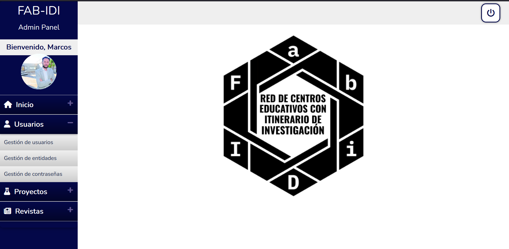
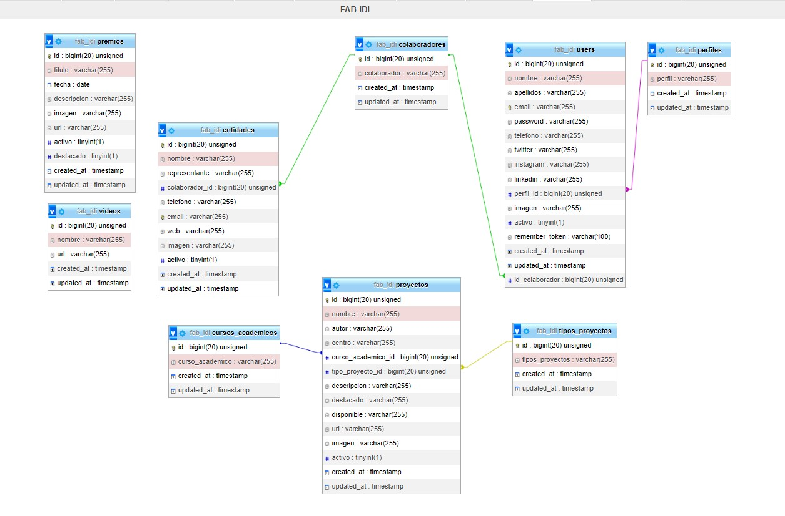

# Diseño

## Diseño general

1. Diseño de la vista
    Inicialmente se presentó [este mockup](https://docs.google.com/presentation/d/16oBmQjaefnTi5_7hHlGRfftekw3BZwavsjYj6rR1YyM/edit#slide=id.p) de la aplicación a los clientes para que pudieran ver el diseño de la aplicación y para que pudieran realizar sugerencias y cambios. 

2. Diseño de la base de datos
    La base de datos se ha diseñado utilizando MySQL y phpMyAdmin. Se ha utilizado el modelo relacional para el diseño de la base de datos. 

## Diseño detallado

1. Diseño de la vista
    La vista principal de la web es la siguiente:

    

    A través del menú principal se puede acceder a las diferentes secciones de la aplicación. En la parte superior derecha se encuentra el botón de inicio de sesión. A través de este botón los usuarios con permisos de administrador pueden acceder al panel de administración desde el que pueden gestionar los diferentes recursos de la aplicación.
    
    En el panel de administración hemos usado un estilo diferenciado para distinguir claramente esa área de trabajo especializada y de este modo enfatizar visualmente una parte que está reservada a un grupo de usuarios concretos y no es accesible para el resto de usuarios.

    

2. Diseño de la base de datos

