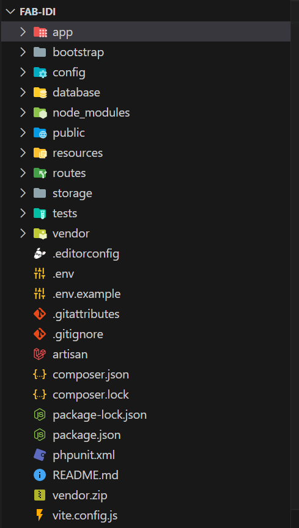

# Implantación

## 1. Entorno de desarrollo

Para el desarrollo de la aplicación se ha utilizado el framework Laravel. Para poder utilizar este framework es necesario tener instalado un entorno de desarrollo que incluya los siguientes componentes:

-   PHP 7.4 o superior

-   Composer

-   Servidor web (Apache o Nginx)

-   Servidor de base de datos (MySQL o MariaDB)

-   Node.js

-   Git

-   Editor de código (Visual Studio Code, Sublime Text, Atom, etc.)

-   Terminal (Git Bash, CMD, PowerShell, etc.)

## 2. Clonación del repositorio

En primer lugar, es necesario clonar el repositorio del proyecto.

Para clonar el proyecto, sigue estos pasos:

1. Crea una nueva carpeta en tu sistema local.

2. Accede a la carpeta que acabas de crear.

3. Ejecuta el siguiente comando para clonar los datos del repositorio:
    
    [https://github.com/iesgrancapitan-proyectos/202223daw-junio-FAB_IDI-Ordonez-Cervilla.git](https://github.com/iesgrancapitan-proyectos/202223daw-junio-FAB_IDI-Ordonez-Cervilla.git)

## 3. Instalación del proyecto

### Instalación de dependencias

1. Descarga e instalación de Composer en tu dispositivo:
* Visita la página oficial de Composer en su página oficial y descarga el archivo composer.exe correspondiente.
* Ejecuta el archivo descargado para iniciar el proceso de instalación.
* Durante la instalación, se te solicitará establecer la ruta de PHP. Asegúrate de tener XAMPP u otro entorno de desarrollo con PHP instalado previamente.
* Verificar la instalación de Composer:
* Abre la terminal de tu sistema operativo.
    Escribe el comando composer -v y presiona Enter. Si Composer está correctamente instalado, verás información sobre la versión instalada y otros detalles.

2. Una vez que hayas instalado Composer y clonado el proyecto en la carpeta correspondiente, sigue estos pasos adicionales:

* Dentro del directorio raíz del proyecto clonado, abre una terminal o línea de comandos.

* Ejecuta el siguiente comando: 
        
        composer update

     Este comando leerá el archivo composer.json presente en el proyecto y procederá a instalar o actualizar las dependencias requeridas para el proyecto.

    Una vez que se complete la ejecución de composer update, habrás instalado las dependencias necesarias para el proyecto mediante Composer.

## 4. Configuración de la base de datos

Para configurar la base de datos, sigue estos pasos:

1. Abre el archivo .env que se encuentra en el directorio raíz del proyecto.

2. En el archivo .env, busca las siguientes líneas de código:

    DB_CONNECTION=mysql

    DB_HOST=

    DB_PORT=

    DB_DATABASE=

    DB_USERNAME=

    DB_PASSWORD=

* Correo:

    MAIL_MAILER=smtp

    MAIL_HOST=smtp.gmail.com

    MAIL_PORT=587

    MAIL_USERNAME=

    MAIL_PASSWORD=

    MAIL_ENCRYPTION=tls

3. Completa los campos correspondientes con los datos de tu base de datos local.

4. Guarda los cambios realizados en el archivo .env.

5. Ejecuta el siguiente comando para crear las tablas de la base de datos:

        php artisan migrate

## 5. Ejecución del proyecto	

Para ejecutar el proyecto, sigue estos pasos:

1. Abre una terminal o línea de comandos en el directorio raíz del proyecto.

2. Ejecuta los siguientes comando para iniciar el servidor de desarrollo:

        php artisan serve

        npm run dev

3. Abre un navegador web y accede a la siguiente URL:
    
            http://localhost:8000

4. Si todo ha ido bien, deberías ver la página de inicio de la aplicación.

